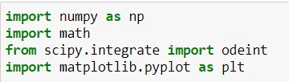
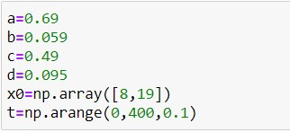
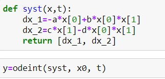
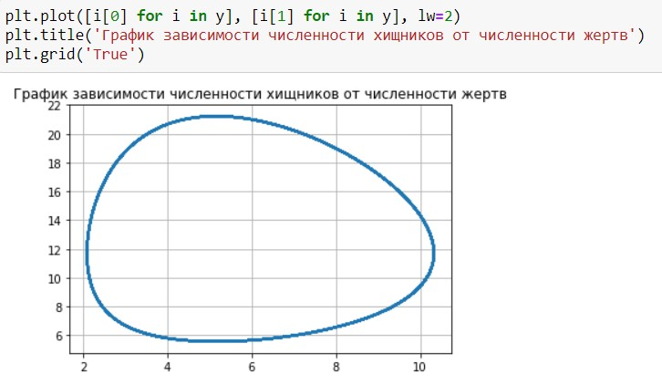
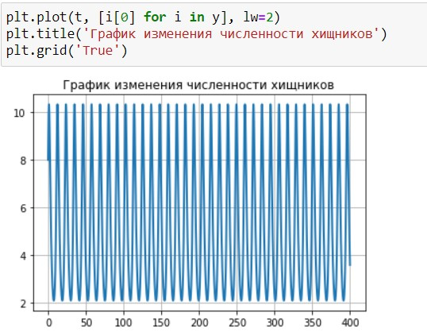
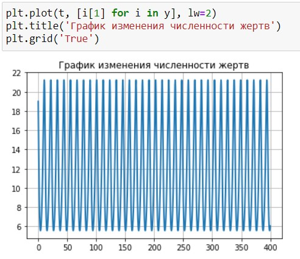
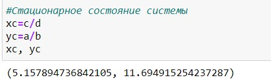

---
## Front matter
title: "Лабораторная работа №5: Модель хищник-жертва"
subtitle: "*дисциплина: Математическое моделирование*"
author: "Голова Варвара Алексеевна"
date: 2021, 11 March

## Formatting
mainfont: PT Serif
romanfont: PT Serif
sansfont: PT Sans
monofont: PT Mono
toc: false
slide_level: 2
theme: metropolis
header-includes:
 - \metroset{progressbar=frametitle,sectionpage=progressbar,numbering=fraction}
 - '\makeatletter'
 - '\beamer@ignorenonframefalse'
 - '\makeatother'
aspectratio: 43
section-titles: true

---

# Цель работы

Ознакомиться с моделью "хищник-жертва" и построить графики по этой модели.

# Задание

Для модели «хищник-жертва»:
$$\begin{cases}
\frac{dx}{dt}=-0.69x(t)+0.059x(t)y(t)\\
\frac{dy}{dt}=0.49y(t)-0.096x(t)y(t)
\end{cases}$$

Построить график зависимости численности хищников от численности жертв,
а также графики изменения численности хищников и численности жертв при
следующих начальных условиях: $x_0=8$, $y_0=19$. Найти стационарное
состояние системы.

# Выполнение лабораторной работы

## Библиотеки

Подключаю все необходимые библиотеки(рис. -@fig:001).

{ #fig:001 width=70% }

## Значения

Ввод значений из своего варианта (28 вариант)(рис. -@fig:002).

{ #fig:002 width=70% }

## Решение

Решение системы(рис. -@fig:003).

{ #fig:003 width=70% }

## Вывод графика №1

Вывод графика зависимости численности хищников от численности жертв(рис. -@fig:004).

{ #fig:004 width=70% }

## Вывод графика №2

Вывод графика изменения численности хищников(рис. -@fig:005).

{ #fig:005 width=70% }

## Вывод графика №3

Вывод графика изменения численности жертв(рис. -@fig:006).

{ #fig:006 width=70% }

## Стационарное состояние системы

Система будет стационарна в точке с координатами (5.157894736842105, 11.694915254237287)(рис. -@fig:007).

{ #fig:007 width=70% }

# Выводы

Я ознакомилась с моделью "хищник-жертва", построила графики по этой модели и нашла стационарное состояние системы.
